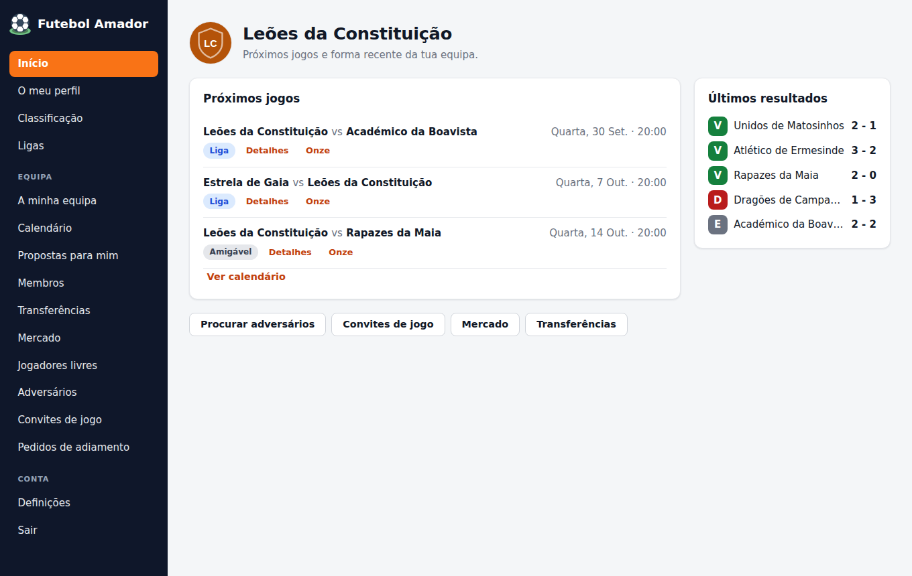
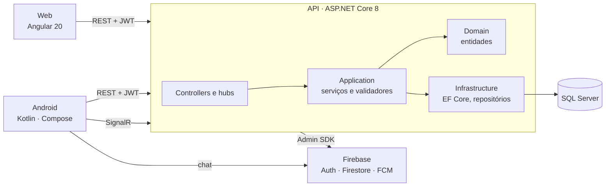

# Futebol Amador

Plataforma para organizar futebol amador: equipas, convites de jogo, calendário, resultados e uma classificação com divisões. Tem uma API em ASP.NET Core, um frontend web em Angular e uma app Android em Kotlin, que partilham a mesma base de dados e o mesmo Firebase.

Trabalho de grupo de **Laboratório de Desenvolvimento de Software** (3.º ano da Licenciatura em Engenharia Informática, ESTG – Politécnico do Porto, 2025/26), revisto em 2026. A app Android foi desenvolvida em paralelo para a unidade curricular de Computação Móvel e Ubíqua.

[](https://github.com/fmpoliveira05-jpg/futebol-amador/actions/workflows/backend.yml)
[](https://github.com/fmpoliveira05-jpg/futebol-amador/actions/workflows/web.yml)
[](https://github.com/fmpoliveira05-jpg/futebol-amador/actions/workflows/android.yml)

**Experimentar sem instalar nada:** [demonstração web](https://fmpoliveira05-jpg.github.io/futebol-amador/) (dados fictícios em memória; qualquer e-mail e palavra-passe servem).



## Equipa

| | | |
|---|---|---|
| Artur Pinto | backend e app Android | |
| Willkie Filho | backend e app Android | |
| Ian Costa | backend e frontend web | |
| Francisco Oliveira | backend e frontend web | [@fmpoliveira05-jpg](https://github.com/fmpoliveira05-jpg) |

Os três repositórios originais (backend, web e Android) foram juntados neste, com o histórico completo, por isso o contributo de cada um continua visível no separador *Commits*.

**O meu papel:**

- No **backend**:
  - os pedidos de adesão a equipas, com os filtros de pesquisa;
  - a autenticação (login, logout e alteração da palavra-passe);
  - a classificação geral;
  - boa parte dos testes unitários dos serviços de equipas, jogos e convites.
- No **frontend web**:
  - login e registo;
  - perfil de jogador e pedidos de adesão;
  - lista de jogadores sem equipa;
  - calendário e cancelamento de jogos;
  - a documentação Compodoc.
- Na **revisão de 2026**:
  - juntei os três repositórios e limpei segredos do histórico;
  - corrigi as falhas de segurança e os erros descritos mais abaixo;
  - reescrevi o frontend web com a interface nova, o modo demonstração e os testes;
  - pus os testes de integração do backend a correr no CI.

A app Android é sobretudo do Artur e do Willkie; na revisão só lhe corrigi erros.

## O que faz

- **Equipas.** Qualquer jogador cria uma equipa com o campo onde joga e fica administrador (até 4 por equipa).
  - Os administradores aceitam pedidos de adesão e convidam jogadores sem equipa.
  - Também promovem e removem membros.
- **Jogos amigáveis.**
  - Um administrador procura adversários (por divisão, cidade, pontos, idade média ou número de jogadores) e envia um convite com data e campo.
  - O adversário aceita, recusa ou faz uma contraproposta.
  - Depois de marcado, o jogo pode ser adiado (o adversário tem de aceitar) ou cancelado com um motivo.
- **Jogos competitivos** (app Android). As equipas entram numa fila de *matchmaking* para domingo.
  - Um serviço em segundo plano emparelha equipas com pontos e idades médias parecidas.
  - Se não houver par, alarga os critérios aos poucos.
- **Resultados e classificação.** No fim do jogo, os administradores das duas equipas registam o resultado em tempo real (SignalR). Só quando os dois coincidem o jogo fica terminado.
  - Os jogos competitivos dão pontos, e as equipas sobem e descem de divisão.
  - Há uma classificação geral das 100 melhores equipas.
- **Tempo real.** Chat de cada jogo (Firestore), notificações push (Firebase Cloud Messaging) e hubs SignalR para iniciar e terminar jogos.

## Arquitetura



- **Backend** em Clean Architecture: `Domain` (entidades e regras), `Application` (serviços, validadores e interfaces dos repositórios), `Infrastructure` (EF Core e SQL Server) e `Api` (controllers REST, hubs SignalR e serviços em segundo plano).
- **Autenticação** com Firebase Authentication. A API valida os ID tokens do Firebase como JWT e o uid identifica o jogador na base de dados.
- **Web** em Angular 20 sem zone.js: componentes *standalone*, estado em *signals*, rotas com *lazy loading* e interceptor e *guard* funcionais.
- **Android** em Kotlin com Jetpack Compose, MVVM, Hilt, Retrofit, Room (sessão local) e SignalR.

## Estrutura

```
backend/   API ASP.NET Core 8 (Clean Architecture) + testes NUnit (unitários e de integração)
web/       frontend Angular 20 + testes Jasmine/Karma e Playwright
mobile/    app Android (Kotlin, Jetpack Compose)
docs/      capturas de ecrã
```

Cada pasta tem o seu README com os detalhes e as instruções.

## Como executar

**Só o frontend, com dados de exemplo** (Node.js 20 ou superior):

```bash
cd web
npm ci
npm run demo        # abre em http://localhost:4200
```

**Sistema completo:** precisa de SQL Server e de um projeto Firebase. Os passos estão no [README do backend](backend/README.md), no [do web](web/README.md) e no [do Android](mobile/README.md).

**Testes:**

```bash
cd backend && dotnet test               # unitários e de integração (base de dados em memória, sem Firebase)
cd web && npm run test:ci && npx playwright test
cd mobile && ./gradlew testDebugUnitTest
```

## O que mudou na revisão de 2026

### Repositório

- Os três repositórios foram juntados num só, com o histórico completo de todos os autores.
- Foram retirados do histórico:
  - as passwords da base de dados;
  - as chaves do Firebase;
  - tokens de teste;
  - as credenciais usadas nos testes do Cypress;
  - pastas geradas (`bin/`, `obj/`, `node_modules/`, relatórios de cobertura).
- CI com um workflow por pasta, que só corre quando essa pasta muda. Os testes de integração do backend e os testes web não precisam de segredos.

### Segurança (backend)

- Qualquer utilizador autenticado podia **editar o perfil de outro**: o id do jogador vinha no corpo do pedido.
- Nos **pedidos de adesão** havia três falhas:
  - as verificações de administrador estavam comentadas;
  - um administrador de uma equipa podia aceitar pedidos de outra;
  - um jogador podia aceitar o seu próprio pedido e entrar na equipa sem aprovação.
- Qualquer pessoa, **mesmo sem sessão**, podia criar um super administrador.
- O e-mail, o telefone e a morada dos jogadores eram **públicos** (perfil, plantel e lista de membros). Agora só os vêem o próprio jogador e os colegas de equipa.
- A alteração da palavra-passe era um `GET` com as palavras-passe no URL.
- O `GlobalExceptionHandler` nunca chegava a ser usado. Todos os erros de negócio saíam como 500, com a mensagem interna. Agora há 400, 401, 403 e 404 e os 500 não mostram detalhes.

### Erros corrigidos

- **Backend:**
  - O *matchmaking* competitivo nunca funcionava:
    - as horas até ao jogo eram calculadas ao contrário;
    - os jogos emparelhados não eram guardados;
    - as equipas ficavam na fila;
    - o cálculo da divisão rebentava nas divisões mais baixas.
  - Recusar um adiamento cancelava o jogo.
  - Um jogo terminado podia ser terminado outra vez, com pontos em dobro, e os amigáveis também davam pontos.
  - Outros erros:
    - a idade dos jogadores vinha em dias;
    - a lista de membros rebentava sempre;
    - o hub de notificações não conseguia arrancar;
    - o chat dos convites perdia-se ao criar o jogo.
- **Web:**
  - A pesquisa de equipas chamava uma rota que não existe e os pedidos de adesão enviavam dados no formato errado.
  - O build de desenvolvimento usava sempre o ambiente de produção.
  - A sessão não expirava.
  - O Avançado (posição 0) era tratado como "sem posição".
  - Vários ecrãs não atualizavam porque a app corre sem zone.js e o estado não estava em *signals*.
- **Android:**
  - A app fechava depois de enviar um convite, porque navegava para uma rota inexistente.
  - As posições estavam na ordem inversa da API: um avançado ficava registado como guarda-redes.
  - Os erros de registo eram ignorados.
  - O endereço da API era um túnel ngrok temporário.

### Frontend web

- Interface nova:
  - estilos partilhados;
  - menu que muda com o papel do utilizador e funciona em telemóvel;
  - página inicial com os próximos jogos e a forma recente;
  - páginas novas de classificação, pedidos de adiamento e alteração da palavra-passe.
- **Modo demonstração:** um interceptor responde à API com dados em memória. Serve para experimentar a aplicação, para os testes de ponta a ponta e para a versão publicada no GitHub Pages.
- Testes: 50 unitários (Jasmine/Karma) e 9 de ponta a ponta com Playwright (em desktop e telemóvel), em vez dos testes Cypress que dependiam da API de produção.

## Limitações conhecidas

- O sistema completo precisa de um projeto Firebase próprio (Authentication, Firestore e Cloud Messaging) e de um SQL Server. Sem eles só funciona o modo demonstração do frontend.
- A sessão da app Android é lida da base de dados local no *thread* principal (`allowMainThreadQueries`), porque é usada por interceptores síncronos.
- A app Android não tem testes unitários além do contrato das posições. Os testes instrumentados precisam de um emulador e não correm no CI.
- O backend e a app Android não foram compilados durante a revisão, porque o ambiente usado não tinha o SDK do .NET nem o do Android. A verificação é feita pelos workflows do GitHub Actions.
