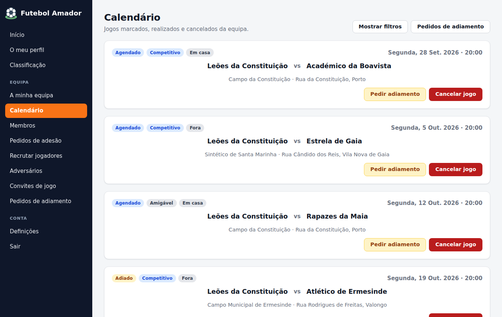

# Futebol Amador – frontend web

Frontend em Angular 20 do Futebol Amador. Visão geral do projeto no [README principal](../README.md).



## Experimentar

```bash
npm ci
npm run demo      # http://localhost:4200
```

O **modo demonstração** (`npm run demo`) não precisa do backend:

- o `demoInterceptor` responde aos pedidos à API com dados em memória: uma pequena liga do Grande Porto, com 8 equipas, jogos, convites e pedidos;
- qualquer e-mail e palavra-passe servem para entrar como administrador dos "Leões da Constituição";
- as alterações ficam guardadas no `sessionStorage` do separador.

A mesma versão está publicada no GitHub Pages.

Contra a API a correr localmente (`http://localhost:5218`, ver o [README do backend](../backend/README.md)):

```bash
npm start
```

## Páginas

| Quem | O que pode fazer |
|---|---|
| Visitante | apresentação, classificação, criar conta, entrar |
| Jogador sem equipa | procurar equipas e pedir para entrar, responder a convites, criar uma equipa |
| Membro de uma equipa | página inicial com os próximos jogos e a forma recente, perfil da equipa, calendário |
| Administrador | editar e apagar a equipa, gerir membros, aceitar pedidos, recrutar jogadores, procurar adversários, convites de jogo (aceitar, recusar, contraproposta), adiar e cancelar jogos, responder a pedidos de adiamento |

O menu lateral muda com o papel. As rotas estão protegidas pelo `authGuard`, com as opções `requiresTeam`, `requiresNoTeam` e `isAdmin` (esta última confirmada na API).

## Organização do código

```
src/app/
  core/interceptors/     authInterceptor: token só para a API; 401 termina a sessão
  core/demo/             modo demonstração (interceptor + dados)
  services/              um serviço por recurso da API
  shared/auth/           authGuard (funcional)
  shared/http/           conversão de filtros em query params e mensagens de erro da API
  shared/Dtos/           modelos dos pedidos e respostas
  components/pages/      páginas (carregadas a pedido)
  components/partials/   menu, pesquisa de equipas, formulário de equipa
```

Algumas decisões:

- **Sem zone.js.** O estado dos componentes está em *signals* e a deteção de alterações é *zoneless*.
- **Componentes *standalone*** com *control flow* (`@if`, `@for`) e parâmetros de rota como `input()` (`withComponentInputBinding`).
- **Sessão em cookies** (`SameSite=Strict`, `Secure` em HTTPS).
  - O `AuthService` expõe o estado da sessão como *signal*.
  - O `isAuthenticated()` verifica a expiração do JWT.
- **Erros da API** (`ProblemDetails`, erros de validação do ASP.NET, falta de ligação) são convertidos em mensagens para o utilizador por `mensagemDeErro`.
- **Emblemas** das equipas: são reduzidos no browser a 256×256 antes do envio, para ocuparem poucos KB.
- **Lazy loading** de todas as páginas: o bundle inicial tem cerca de 340 kB (96 kB comprimido).

## Testes

```bash
npm run test:ci            # 50 testes unitários (Jasmine/Karma, Chrome headless) com cobertura
npx playwright test        # 9 cenários de ponta a ponta, em desktop e telemóvel, contra o modo demonstração
```

Os testes unitários cobrem:

- `AuthService` (sessão e expiração do token);
- interceptor e *guard*;
- serviço de pedidos de adesão (formato dos pedidos);
- utilitários HTTP e de imagem;
- ordenação do calendário;
- idade mínima no registo;
- modo demonstração.

Os testes de ponta a ponta percorrem os fluxos principais:

- entrar e voltar à página pedida;
- aceitar um pedido de adesão;
- convidar uma equipa para um jogo;
- aceitar um adiamento;
- filtrar o calendário;
- sair.

As capturas de ecrã do README são geradas pelo Playwright: `CAPTURAS=1 npx playwright test capturas --project=desktop`.

## Build

```bash
npm run build              # produção, usa src/app/environments/environment.ts
npm run build:demo         # versão de demonstração
```

O endereço da API de produção está em `environment.ts`. Para desenvolvimento local, `environment.development.ts` aponta para `http://localhost:5218/api`.
